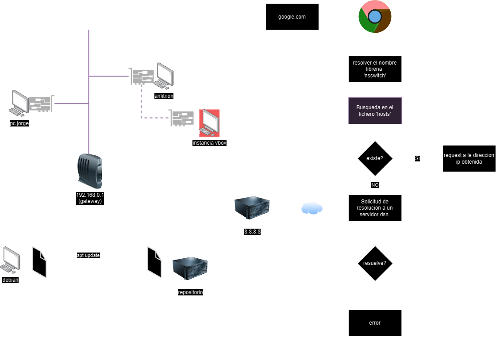
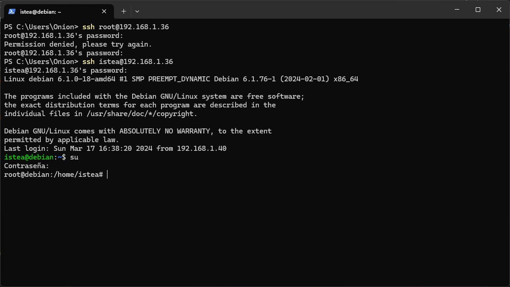
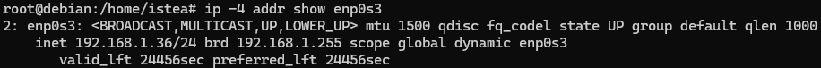

# Anotaciones extra

## Funcionamiento de DNS en Linux

## Acceder con SSH
- Por defecto, muchos sistemas (incluyendo Ubuntu) deshabilitan el inicio de sesión basado en contraseña para el usuario **root** a través de SSH. En su lugar, solo permiten la **autenticación basada en clave**.
- Para habilitar el acceso SSH para el usuario **root** utilizando una contraseña, sigue estos pasos:
    - Edita el archivo de configuración de SSH:
        
        ```bash
        sudo nano /etc/ssh/sshd_config
        ```
        
    - Cambia la línea:
        
        ```
        PermitRootLogin without-password
        ```
        
        a:
        
        ```
        PermitRootLogin yes
        ```
        
    - Guarda el archivo y sal.
    - Reinicia el servidor SSH:
        
        ```bash
        sudo service ssh restart
        ```
        
- Esto debería permitirte conectarte como **root** utilizando tu contraseña

## Interfaces de RED
Se puede agregar `-4` al comando `ip` para que muestre una versión específica de rangos IP, por ejemplo `ip -4 addr show enp0s3` muestra el estado de la conexión IPv4 del adaptador `enp0s3`.



En el comando:

```
ip addr add 192.168.1.10/24 dev interface
```

La palabra **“dev”** se refiere a la **interfaz de red** a la cual se le está asignando la dirección IP. En este contexto, **“dev”** es una abreviatura de **“device”**, que en español significa **“dispositivo”**. Por lo tanto, la instrucción completa indica que estás agregando la dirección IP **192.168.1.10/24** a la interfaz de red especificada.