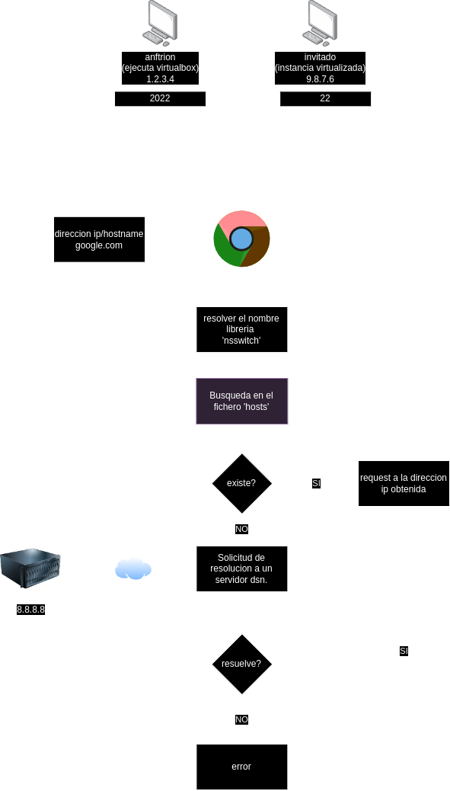
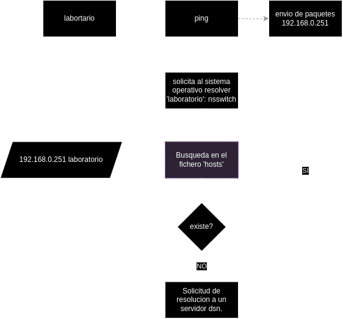
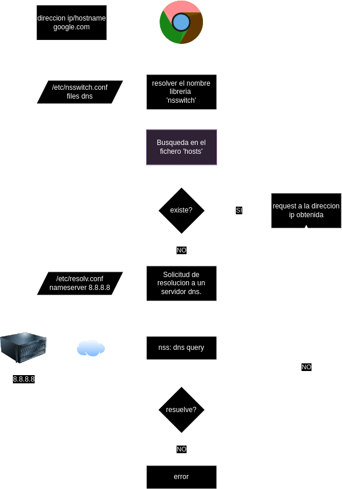
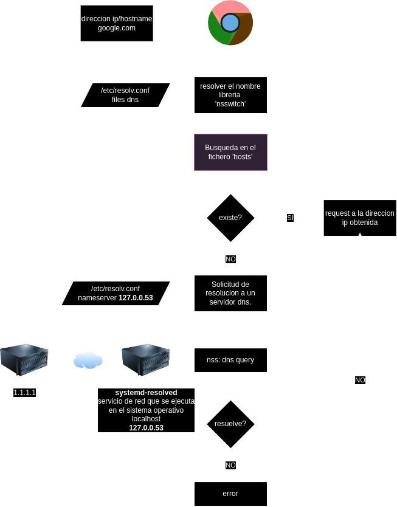

# Anotaciones extra

## DNS e IPs en Virtualbox

* Red 'NAT' VirtualBox: reenvio de puertos
	Configurar la instancia en red 'NAT', luego en la misma pantalla abrir las "opcioens avanzadas > reenvio de puertos".
	* nombre: ssh
	* protocolo: tcp
	* ip anfitrion: 0.0.0.0 (**Quiere decir que me puedo conectar con cualquier dispositivo que esté en la misma red LAN**)
	* puerto anfitrion: 2022
	* ip invitado: 10.0.2.15 (**De la VM en Virtualbox**)
	* puerto invitado: 22
+ Conexion ssh:
```bash
$ ssh -p 2022 istea@ip_anfitrion #IP de la máquina HOST
```


## Ping interno


## Resolución a través de `/etc/nsswitch.conf`
 

## Administración de DNS a través de `systemd-resolved` 
 
 
 